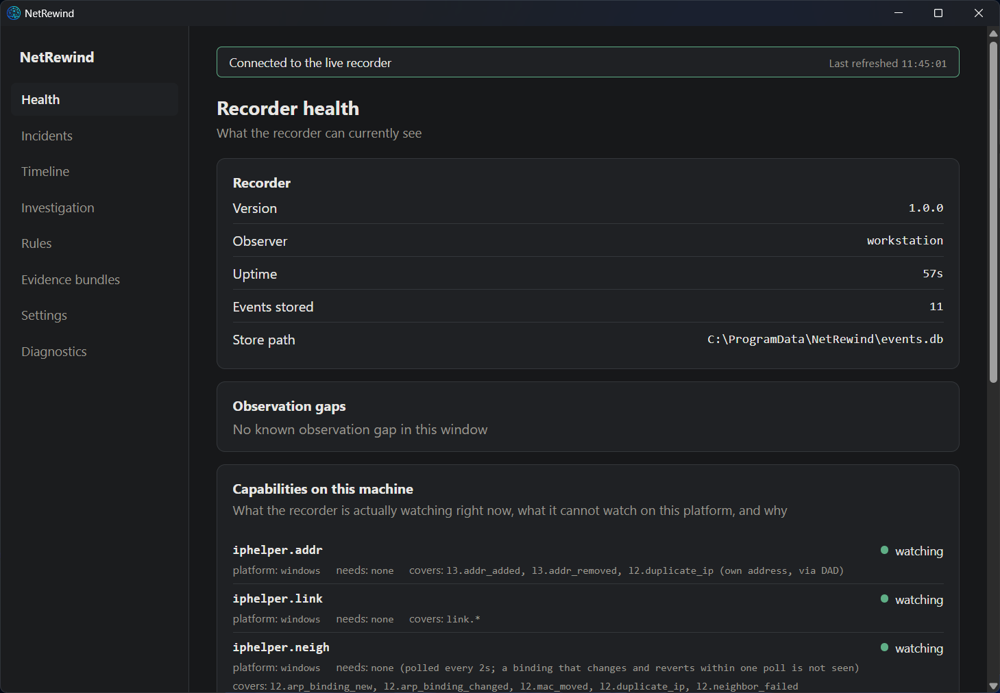
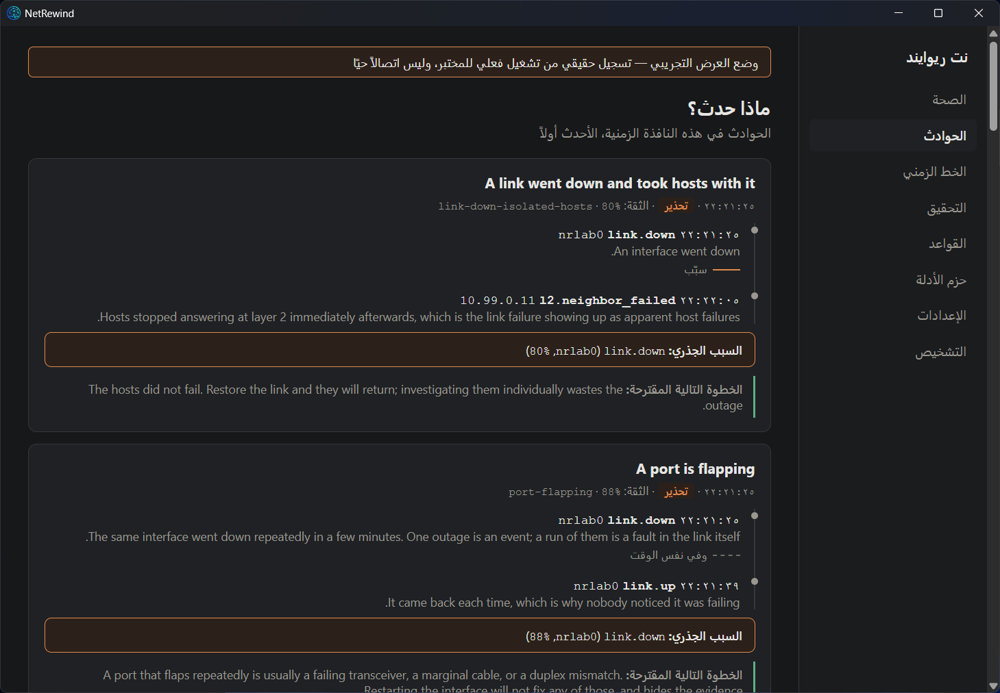

<p align="center">
  
</p>

# NetRewind — a black box recorder for the network

NetRewind records what *changed* on a network — interfaces, ARP bindings,
addresses, routes, flows, filtering decisions — and reconstructs the causal
chain of an outage after it is over, when the evidence would normally be gone.

It is two programs:

- **The recorder**, `netrewindd`: a service on Linux (netlink, eBPF, nftables,
  the wire) or Windows (the IP Helper API) that watches the kernel and appends
  every state change to a local store, then correlates those changes into
  incidents with an explicit causal chain.
- **The desktop application**: an Arabic/English viewer that reads a live
  recorder over a local-only channel, or opens an evidence bundle exported from
  any recorder, and shows the recorder's own account of what it can and cannot
  see on that machine.

A `netrewind` command-line tool asks the same questions from a terminal.

**Status: 1.0.0.** Every capability below is backed by a test or a recorded
run under [docs/evidence](docs/evidence/); what a given platform cannot do is
listed in [the capability matrix](#what-each-platform-records), not left to be
discovered.

<p align="center">
  
</p>

## The problem

When a network breaks, the honest description of the situation is usually:

> The connection dropped at 10:43 and we do not know why.

The evidence is scattered across switch logs, firewall logs, DHCP and DNS, each
with its own clock and its own format — and most of it has already rolled over
by the time anyone looks. So the engineer guesses, swaps a cable, restarts a
service, and the fault comes back in two days.

Worse is the intermittent fault: *it drops for ninety seconds every couple of
days, at no particular time*. There is no practical way to be watching when it
happens. Packet capture fills the disk in an hour. So it goes unsolved for
months.

## The idea

Record state changes, not packets.

Almost everything that breaks a local network is a state change: a carrier
drops, an ARP binding moves, a route disappears, a second DHCP server appears,
an ACL starts rejecting a pair of hosts that were talking a minute ago. Those
are cheap to observe and cheap to keep — orders of magnitude smaller than
capturing traffic — and they are *already the answer*, rather than raw material
that has to be mined for one.

Put them all on one timeline, at nanosecond resolution, and the story assembles
itself:

```
10:41:58  a second DHCP server appeared on 192.168.20.99
10:42:17    nine hosts took a different default gateway
10:42:19      34% packet loss outbound
10:42:23        41 TCP connections to Server X dropped
10:47:12  ended - port Gi0/14 was shut manually
```

## Getting started

### Linux

```bash
sudo apt install ./netrewind_1.0.0_amd64.deb          # or dnf install the .rpm
sudo systemctl enable --now netrewindd
sudo usermod -aG netrewind "$USER"                     # to read it without root; log in again
netrewind status                                       # what is it watching?
netrewind incidents --last 1h                          # what happened?
```

Then install the `netrewind-desktop` package (or run the AppImage) and choose
*Live recorder* on first run.

### Windows

Run `NetRewind_1.0.0_x64-setup.exe` as an administrator. It installs the
desktop application, installs the recorder as the `netrewindd` service and
starts it. Open NetRewind and choose *Connect to the local recorder*.

### From source

```bash
make all          # fmt, vet, test, build the recorder and CLI for this platform
make desktop      # UI tests, then the desktop installers (needs Node 22, Rust, and on Linux WebKitGTK)
sudo make lab     # Linux: the fourteen-fault synthetic lab, end to end
```

[docs/install.md](docs/install.md) has every detail: packages, the tarball
and `install.sh`, the Windows service commands, upgrading, removing, and the
configuration keys.

## What each platform records

The recorder reports this itself — `netrewind status` and the desktop's
Health page read the registry every collector is registered in — so the
table below is a summary of what the build does, not a promise the software
cannot check.

| Fact | Linux source | Windows source |
|---|---|---|
| Interface up/down, administrative vs. carrier, MTU, error rate | netlink (`netlink.link`) | IP Helper interface notifications (`iphelper.link`) |
| Addresses added and removed | netlink (`netlink.addr`) | IP Helper address notifications, recorded once duplicate-address detection completes (`iphelper.addr`) |
| Routes: the winner for a destination changing, the default route lost or moved | netlink (`netlink.route`) | IP Helper route notifications (`iphelper.route`) |
| ARP/ND bindings: new, changed, moved, contested, failed | netlink (`netlink.neigh`) | the neighbour table, polled every 2 s (`iphelper.neigh`) |
| TCP connections: handshakes failing, resets, rollups | eBPF (`ebpf.flow`) | not in this release |
| Filtering policy changes | nftables (`policy.nftables`) | not in this release |
| DHCP servers, DNS resolvers, ICMP unreachable, MTU black holes on the wire | raw sockets (`wire`) | not in this release |
| Reachability probes to the gateway | ICMP (`probe.icmp`) | not in this release |
| Gaps in the record, collectors that stopped, clock steps, self-updates | the recorder itself | the recorder itself |

The desktop application, evidence bundles, the CLI's read commands and the
correlation engine are the same code on both platforms.

## The desktop application

<p align="center">
  
</p>

Three sources — the demo recording it ships with, a live recorder, an
evidence bundle — and eight pages: health and blind spots, incidents,
timeline, investigation by host, rules, evidence bundles, diagnostics and
settings. Arabic-first with full right-to-left layout; addresses, names and
timestamps stay left-to-right. Nothing it does writes to the record.
[docs/desktop.md](docs/desktop.md) walks through it.

## What the recorder does

- Watches interface state, distinguishing an administratively shut port from a
  dropped carrier — different causes, different fixes, and every other tool
  reports them identically
- Watches the neighbour table, so an ARP binding moving under a running network
  is recorded — and flagged as an error rather than a warning when the address
  it moved under is the default gateway
- Watches routing, reporting a change only when the route that actually *wins*
  for a destination changes, so a standby path being installed is not mistaken
  for traffic moving
- Ties observations to machines through a temporal identity table, so asking
  about an address as it was last Tuesday returns the machine that held it
  *then*, not the one holding it now
- Folds repeats so a flapping interface is one growing event rather than ten
  thousand rows
- Records its own blind spots: `system.gap` states exactly how long the recorder
  was not watching, because a gap that is not recorded is indistinguishable from
  a quiet period
- Reads the record back as a narrative, not a table

```
$ netrewind what-happened --host 10.99.0.11 --at 15:00 --window 10m

  !  12:15:50.621             nrlab1 was shut down administratively
  -  12:15:52.628  +2.01s     nrlab1 came back after 2.006s
  !  12:15:53.639  +1.01s     10.99.0.11 moved from 02:00:00:00:00:11 to 02:00:00:00:00:aa
  !! 12:15:54.647  +970ms     10.99.0.201 moved from 02:00:00:00:00:01 to 02:00:00:00:00:ff - this is the default gateway
  !! 12:15:55.660  +1.01s     10.99.0.11 is being claimed by more than one machine  (x3)
  -  12:15:59.685  +4.02s     route to 10.200.0.0/24 now goes via 10.99.1.11 (was 10.99.0.11)
  !! 12:16:01.713  +2.02s     the default route was removed - nothing beyond the local segment is reachable
```

- On Linux, watches TCP connections from inside the kernel with eBPF, and
  reports when **two machines that were talking a moment ago can no longer
  connect** — the strongest single signal that something just changed.
  Ordinary activity is summarised every ten seconds rather than recorded per
  connection, and when the kernel has to drop something, it says so
- Watches the filtering rules in force, so a change to them lands on the same
  timeline as the connections it breaks — qualified by table and chain, because
  the same rule in a different chain is a different rule
- Correlates those events into incidents — and states, for every step, whether
  it *caused* the next one or merely happened alongside it

```
$ netrewind incidents --last 1h

!! A path that was working stopped working
   19:09:19 to 19:09:23  (4s)   rule change-broke-a-path, confidence 88%
   affected: 10.99.1.11

   1  19:09:19.078  l2.arp_binding_changed  10.99.1.11
      This is the last thing that changed on the path before it broke.
      |  which caused
   2  19:09:23.086  flow.first_failure_for_pair  10.99.1.11
      Two machines that had been connecting successfully can no longer
      complete a handshake. Whatever else is true, something between
      them changed.
      |  and at the same time
   3  19:09:23.090  l2.neighbor_failed  10.99.1.11
      Other connections started failing in the same window.

   root cause: l2.arp_binding_changed on 10.99.1.11 (confidence 88%)
   next:
      The change named here is the nearest one in time, not a proven
      cause. Confirm it against your change record before acting.
```

Note the middle column. `which caused` is a claim about mechanism; `and at the
same time` is only co-occurrence. The engine never blurs the two, because a tool
that does teaches its operator to distrust it — and an operator who distrusts
the timeline is back to guessing.

- Serves a **local API** (a Unix socket or a named pipe, never a TCP port) that
  the desktop application and `netrewind status` read — see
  [docs/api.md](docs/api.md)
- Exports and imports **evidence bundles**: a checksummed, optionally signed
  archive of a window of the record, made to be handed to somebody else and
  opened without touching their own record
- Exports **how much it did not see**, so the recorder's own reliability is
  something you can alert on rather than something you discover during the
  incident review

```
$ netrewind events --last 1h --family system      # was it even watching?
$ curl -s localhost:9464/metrics | grep blind

# HELP netrewind_recorder_blind_seconds_total Seconds the recorder was not
#      watching. Any increase means the record has a hole in it.
netrewind_recorder_blind_seconds_total 0
```

- Shows the same record in a browser, from the same binary. `netrewind serve`
  is server-rendered, needs no JavaScript, and is read-only — the store is
  evidence, and the thing that displays evidence has no business modifying it
- Copies the record to an **OpenTelemetry collector** if you run one, so network
  change arrives in the same pipeline as everything else
- Keeps **itself** current: it checks its own releases and can install them,
  verifying the checksum published with the release and running the new binary
  before replacing anything. Installing is off by default, because a recorder
  that rewrites its own binary is a change of trust rather than a convenience

## What is not in 1.0

- Windows records interfaces, addresses, routes and neighbours; flows,
  filtering policy, wire-level DHCP/DNS and probes are Linux-only.
- No local AI analysis. Two candidate models were benchmarked against the
  evaluation corpus in both languages and neither met the release gate
  (`ai/eval/`, [docs/evidence](docs/evidence/)); the feature stays off rather
  than shipping a model that invents citations.
- No telemetry, no beta channel, no hosted service. The recorder talks to the
  network only to check for its own updates, and only if asked to.
- Release artefacts are signed with the maintainer's ed25519 key for the
  updater; the Windows installer is not Authenticode-signed.

## How it is different

| Tool | What it gives | What it does not |
|---|---|---|
| NetFlow / ntopng | Traffic statistics | No causal context, no L2/L3 state |
| Zeek / Arkime | Rich logs from a SPAN port | Heavy storage; blind to state and config changes |
| Cilium / Pixie / Retina | Excellent eBPF observability | Built for containers and Kubernetes; know nothing about VLANs, ARP or switches |
| SIEM | Log aggregation | Large infrastructure, and the correlation is still your job |
| SNMP / Nagios | "The interface is down" | One instant, no history, no cause |

The gap NetRewind aims at: light, agentless, aware of the ordinary enterprise
LAN, and producing a causal narrative rather than a wall of alerts.

## Architecture

```
  Linux: netlink · eBPF · nftables · DHCP/DNS/ICMP on the wire · probes
  Windows: IP Helper interfaces · addresses · routes · neighbour table
                          |
                    event collectors        internal/collect
                          |
              platform-neutral observations internal/ports, internal/analyze
                          |
                    common envelope         internal/event
                          |
              identity resolution           internal/identity
                          |
                     event store            internal/store
                          |
              Isnad correlation engine      internal/correlate
                          |
        incidents with an explicit causal chain
                          |
   local API (internal/api/v1 over internal/ipc) · evidence bundles (internal/bundle)
                          |
   desktop application · CLI · web timeline · OpenTelemetry export
```

The correlation core is named **Isnad**, after the classical Arabic method of
establishing a chain of transmission in which every link is named and every link
is verifiable. That is the standard the engine is held to: it distinguishes
`causes` from `correlates` from `precedes`, and never claims a causal link it
cannot show the evidence for.

## Testing

```bash
make vet test                                             # Go, this platform (and a Linux cross-vet)
CGO_ENABLED=1 go test -race ./...                         # Go, on Linux
cd desktop && npm test                                    # the UI
make desktop-resources && cargo test --lib --manifest-path desktop/src-tauri/Cargo.toml   # the desktop shell
sudo make lab                                             # the fourteen-fault lab (Linux)
```

[docs/testing.md](docs/testing.md) lists every suite, the labs, and the
recorded runs behind each claim in this file.

## Documentation

- [Installing](docs/install.md) — packages, services, configuration, upgrades
- [The desktop application](docs/desktop.md) — sources, pages, bundles, options
- [دليل المستخدم باللغة العربية](docs/user-guide-ar.md) — the user guide in Arabic
- [The local API](docs/api.md) — the endpoint and every route
- [Testing](docs/testing.md) — what is tested, where, and the evidence
- [The event schema](docs/schema.md) — the contract everything else depends on
- [Writing a rule](docs/rules.md) — how correlation recognises a failure, and how to teach it a new one
- [Running the recorder](docs/runbook.md) — where to put it, what to alert on, and the three commands to use during an incident
- [Cutting a release](docs/releasing.md) — the signing key, and why it never touches CI
- [Development environment](docs/dev-environment.md) — kernel requirements, the synthetic lab, GNS3 wiring
- [Product documents](docs/product/) — requirements, threat model, data policy, licensing, support matrix, decisions
- [Contributing](CONTRIBUTING.md) — the most valuable thing you can add is a rule, and it needs no Go
- [Changelog](CHANGELOG.md) — what this version does, and what it does not

There is also a [site](https://github.com/OmarAlghafri/NetRewind_website) that
introduces the project, if you want the shape of it before the detail.

## Licence

AGPL-3.0. See [LICENSE](LICENSE) and [NOTICE](NOTICE).
